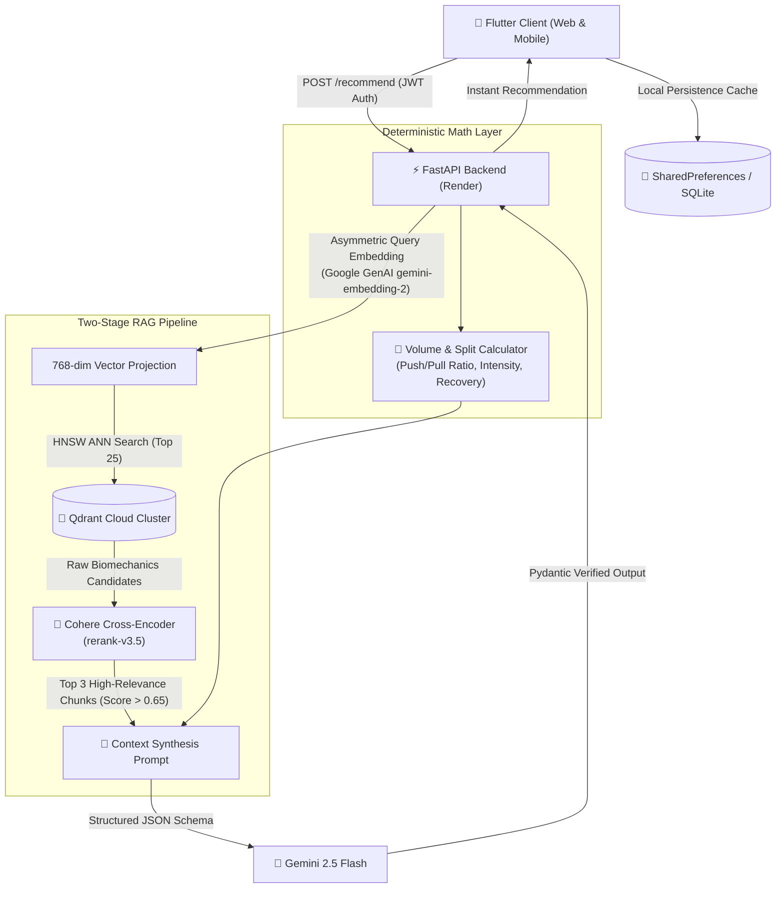

# 🏋️ PulseFit AI – RAG-Powered Fitness Intelligence & Workout Copilot

[](https://joelaah.github.io/fitness_app/)
[](https://flutter.dev)
[](https://fastapi.tiangolo.com)
[](https://qdrant.tech)
[](https://cohere.com)
[](https://supabase.com)

PulseFit AI is an enterprise-grade fitness tracking and intelligent coaching application. It pairs a high-performance **Flutter Web / Mobile** interface with a **Two-Stage Retrieval-Augmented Generation (RAG)** copilot that delivers hyper-personalized, biomechanically sound workout recommendations based on real user training logs.

🔗 **Live Web App:** [https://joelaah.github.io/fitness_app/](https://joelaah.github.io/fitness_app/)  
🔗 **RAG Backend Repository:** [https://github.com/joelaah/fitness-rag-api](https://github.com/joelaah/fitness-rag-api)

---

## 🏛️ System Architecture



---

## ✨ Key Architectural Highlights

### 1. Two-Stage RAG (Recall & Precision)
- **Asymmetric Vector Embeddings**: Uses `RETRIEVAL_DOCUMENT` during ingestion and `RETRIEVAL_QUERY` during inference, properly aligning question and document manifolds.
- **Bi-Encoder Recall + Cross-Encoder Precision**: Retrieves top-25 candidate biomechanics chunks from **Qdrant Cloud** (sub-10ms ANN), then reranks using **Cohere Cross-Attention (`rerank-v3.5`)** to eliminate semantic drift.

### 2. Deterministic Guardrails Against LLM Hallucinations
- Volume progression, total sets, reps, and push/pull ratio balance are **never calculated by the neural model**.
- Arithmetic calculations are computed deterministically in Python and injected into the prompt alongside retrieved science literature, eliminating numerical hallucinations.

### 3. Client-Side Resilience & Offline Fallback
- **Optimistic Caching**: If network latency exceeds the budget or the cloud service undergoes cold starts, the Flutter client gracefully falls back to cached recommendations with visual indicator flags.
- **CanvasKit Web Engine**: Web build utilizes Flutter's hardware-accelerated CanvasKit renderer for 60fps smooth animations and zero UI stutter.

---

## 📁 Repository Structure

```
fitness_app/
├── assets/                  # High-resolution exercise database, images & icons
├── lib/
│   ├── core/
│   │   ├── config/          # Supabase & API environment bindings
│   │   ├── theme/           # PulseFit dark/neon design system & typography
│   │   └── widgets/         # Shared atomic UI components
│   ├── features/
│   │   ├── auth/            # Supabase authentication & onboarding
│   │   ├── exercises/       # Muscle-group filtered exercise picker
│   │   ├── routines/        # Routine builder, split manager, day planner
│   │   └── workout/         # Live workout logger, timer & AI Coach screens
│   │       ├── models/      # Session, Recommendation & Set data models
│   │       └── services/    # rag_recommendation_service.dart (HTTP + Cache)
│   └── main.dart            # Flutter entry point
└── web/                     # Web deployment assets, splash screen & manifest
```

---

## 🚀 Getting Started

### Prerequisites
- [Flutter SDK](https://flutter.dev/docs/get-started/install) (v3.22+)
- [Google Chrome](https://www.google.com/chrome/) for Web testing

### 1. Clone the repository
```bash
git clone https://github.com/joelaah/fitness_app.git
cd fitness_app
```

### 2. Install dependencies
```bash
flutter pub get
```

### 3. Run Locally
```bash
# Run in Chrome
flutter run -d chrome

# Or run with custom RAG API endpoint
flutter run -d chrome --dart-define=RAG_API_URL=https://fitness-rag-api.onrender.com
```

### 4. Build for Web
```bash
flutter build web --release --base-href /fitness_app/
```

---

## 👨‍💻 Author

**Joel Lalruatkima**  
- **GitHub:** [@joelaah](https://github.com/joelaah)  
- **Email:** [joelapachuau64@gmail.com](mailto:joelapachuau64@gmail.com)
