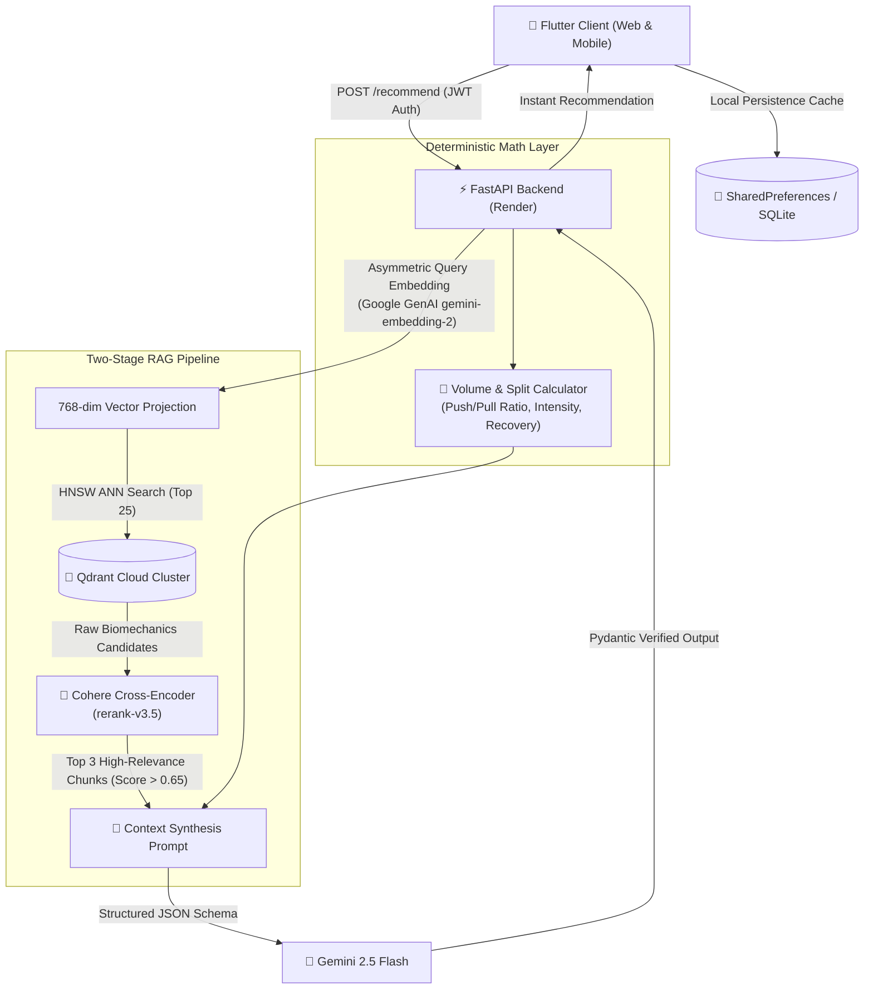

# 🏋️ PulseFit AI – RAG-Powered Fitness Intelligence & Workout Copilot

[](https://joelaah.github.io/fitness_app/)
[](https://joelaah.github.io/fitness_app/portfolio/)
[](https://flutter.dev)
[](https://fastapi.tiangolo.com)
[](https://qdrant.tech)
[](https://cohere.com)
[](https://supabase.com)

PulseFit AI is an enterprise-grade fitness tracking and intelligent coaching application. It pairs a high-performance **Flutter Web / Mobile** interface with a **Two-Stage Retrieval-Augmented Generation (RAG)** copilot that delivers hyper-personalized, biomechanically sound workout recommendations based on real user training logs.

---

## 🔗 Live Deployments & Essential Links

- 🌐 **Live Web Application (PulseFit AI):** [https://joelaah.github.io/fitness_app/](https://joelaah.github.io/fitness_app/)
- 💼 **Interactive Portfolio & Resume:** [https://joelaah.github.io/fitness_app/portfolio/](https://joelaah.github.io/fitness_app/portfolio/)
- ⚡ **Live RAG Backend API (Render.com):** [https://fitness-rag-api.onrender.com](https://fitness-rag-api.onrender.com)
- 📖 **Swagger / OpenAPI Documentation:** [https://fitness-rag-api.onrender.com/docs](https://fitness-rag-api.onrender.com/docs)
- 📁 **Backend Source Repository:** [https://github.com/joelaah/fitness-rag-api](https://github.com/joelaah/fitness-rag-api)

---

## 🏛️ System Architecture


```mermaid
graph TD
    Client["📱 Flutter Client (Web & Mobile)"] -->|"POST /recommend (JWT Auth)"| API["⚡ FastAPI Backend (Render)"]
    
    subgraph "Deterministic Math Layer"
        API --> Calc["📐 Volume & Split Calculator<br/>(Push/Pull Ratio, Intensity, Recovery)"]
    end

    subgraph "Two-Stage RAG Pipeline"
        API -->|"Asymmetric Query Embedding<br/>(Google GenAI gemini-embedding-2)"| Embed["768-dim Vector Projection"]
        Embed -->|"HNSW ANN Search (Top 25)"| Qdrant[("🧠 Qdrant Cloud Cluster")]
        Qdrant -->|"Raw Biomechanics Candidates"| Cohere["🎯 Cohere Cross-Encoder<br/>(rerank-v3.5)"]
        Cohere -->|"Top 3 High-Relevance Chunks (Score > 0.65)"| Prompt["📝 Context Synthesis Prompt"]
    end

    Calc --> Prompt
    Prompt -->|"Structured JSON Schema"| LLM["🤖 Gemini 2.5 Flash"]
    LLM -->|"Pydantic Verified Output"| API
    API -->|"Instant Recommendation"| Client
    Client -->|"Local Persistence Cache"| Cache[("💾 SharedPreferences / SQLite")]
```

---

## 🛡️ Network Safety, Rate Limiting & Resilience

PulseFit AI implements end-to-end network safety across both the Flutter client and the FastAPI backend:

### 1. Client-Side Protection & UX Safeguards (`rag_recommendation_service.dart`)
- **Sliding-Window Rate Limiting**: Chat messaging is capped at a maximum of **15 requests per 5 minutes**, with a **3-second cooldown** between consecutive requests.
- **Recommendation Cooldown**: A strict **10-second cooldown** prevents redundant recommendation generation and unnecessary server load.
- **Input Sanitization**: User messages are trimmed, sanitized against ASCII control characters, and capped at **500 characters** to protect against prompt injection and payload bloating.
- **Cold-Start Auto-Retry**: Automatically sends a fire-and-forget warm-up ping on service instantiation to wake up Render.com free-tier instances. Includes **exponential backoff retries** (2s, 4s delays, 90s timeout) to ensure zero duplicate requests from users.
- **Graceful 429 Handling**: Rate limit violations and server 429 responses trigger informative in-chat feedback rather than app crashes or infinite loading states.

### 2. Server-Side Protection & API Defense (`api.py`)
- **Thread-Safe Sliding-Window Rate Limiter**:
  - `/chat`: Capped at **20 requests per minute** per client IP / user.
  - `/recommend`: Capped at **10 requests per minute** per client IP / user.
  - Global IP Limit: **60 requests per minute** across all endpoints.
  - Returns standard **HTTP 429 Too Many Requests** with `Retry-After` header.
- **Payload Size Guard (HTTP 413)**: Request bodies exceeding **512 KB** are rejected immediately with `413 Payload Too Large` to prevent denial-of-service (DoS) memory attacks.
- **HTTP Security Headers**: Every response injects `X-Content-Type-Options: nosniff`, `X-Frame-Options: DENY`, `X-XSS-Protection: 1; mode=block`, `Strict-Transport-Security`, and `Referrer-Policy: strict-origin-when-cross-origin`.
- **Strict Specification CORS**: Hardened CORS policy avoiding wildcard credentials conflicts (`allow_credentials=False` with universal origin).
- **Strict User Isolation**: User identities are derived strictly from verified Supabase JWT Bearer tokens and never trusted from client-provided JSON payloads.

---

## 👤 Recruiter & Reviewer Guide

Recruiters and hiring managers can explore the app immediately without onboarding barriers:
1. **Zero-Friction Guest Mode**: On launch, anonymous authentication connects seamlessly with Supabase or falls back to local storage—no email or sign-up form required.
2. **Pre-Loaded Exercises & Routines**: Over 1,300+ categorized exercises and sample workout templates are available immediately on the home screen.
3. **Interactive Portfolio & Case Study**: Recruiter case studies, interactive resume, and architecture deep-dives are accessible at `/portfolio/`.

---

## 🔐 Data Storage & Session Architecture

PulseFit AI demonstrates production-grade data persistence and session management across multiple layers:

| Layer | Technology | What It Stores |
|:--|:--|:--|
| **Anonymous Auth** | Supabase GoTrue (`signInAnonymously()`) | Per-device identity with auto-generated UUID — no signup form required |
| **Cloud Database** | Supabase PostgreSQL + RLS (5 tables, 14 policies) | Workout sessions, exercises, sets, profiles, AI recommendations |
| **Local Persistence** | `SharedPreferences` | Routine templates, workout history, offline cache |
| **Session Tokens** | Supabase JWT refresh tokens | Survive app restarts and browser refreshes automatically |
| **Row-Level Security** | `auth.uid()` bindings across all tables | Users can only read/write their own data — enforced at DB level |
| **PWA Installable** | Service worker + `manifest.json` | Installable as native app on mobile & desktop with offline support |

### Security Model
- **Zero email/password friction**: Each device auto-creates a Supabase anonymous identity on first launch
- **Cloud sync with isolation**: Workout data syncs to Postgres but is locked to the device's `auth.uid()` via RLS
- **Offline-first**: `SharedPreferences` caches routines locally — the app works without network connectivity
- **JWT lifecycle**: Supabase manages token refresh automatically; sessions persist across restarts

---

## 📁 Repository Structure

```
fitness_app/
├── assets/                  # 1300+ exercise GIF/image database & icons
├── lib/
│   ├── core/
│   │   ├── config/          # Supabase & API environment bindings
│   │   ├── theme/           # PulseFit dark/neon design system & typography
│   │   └── widgets/         # Shared atomic UI components (chips, charts)
│   ├── features/
│   │   ├── auth/            # Supabase authentication & onboarding
│   │   ├── exercises/       # Muscle-group filtered exercise picker
│   │   ├── routines/        # Routine builder, split manager, day planner
│   │   └── workout/         # Live workout logger, timer & AI Coach screens
│   │       ├── models/      # Session, Recommendation & Set data models
│   │       ├── screens/     # ai_coach_screen.dart (Chat & Plan tabs)
│   │       └── services/    # rag_recommendation_service.dart (Rate limit, RAG HTTP)
│   └── main.dart            # Flutter entry point
├── portfolio/               # Recruiter portfolio, resume & project case studies
└── web/                     # Web deployment assets, splash screen & manifest
```

---

## 🚀 Getting Started

### Prerequisites
- [Flutter SDK](https://flutter.dev/docs/get-started/install) (v3.22+)
- [Google Chrome](https://www.google.com/chrome/) for Web testing

### 1. Clone the repository
```bash
git clone https://github.com/joelaah/fitness_app.git
cd fitness_app
```

### 2. Install dependencies
```bash
flutter pub get
```

### 3. Run Locally
```bash
# Run in Chrome
flutter run -d chrome

# Or run with custom RAG API endpoint
flutter run -d chrome --dart-define=RAG_API_URL=https://fitness-rag-api.onrender.com
```

### 4. Build for Web
```bash
flutter build web --release --base-href /fitness_app/
```

---

## 👨‍💻 Author

**Joel Lalruatkima**  
- **Portfolio:** [https://joelaah.github.io/fitness_app/portfolio/](https://joelaah.github.io/fitness_app/portfolio/)  
- **GitHub:** [@joelaah](https://github.com/joelaah)  
- **Email:** [joelapachuau64@gmail.com](mailto:joelapachuau64@gmail.com)
